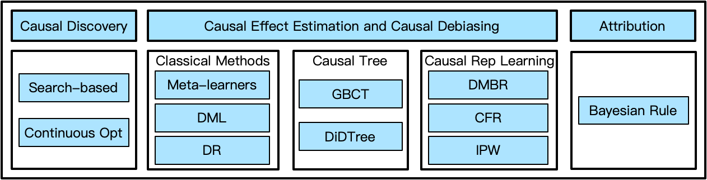

# OpenASCE: A Python Package for End-to-End Large Scale Causal Learning

[](./LICENSE)

OpenASCE (Open All-Scale Casual Engine) is a comprehensive, easy-to-use, and efficient end-to-end large-scale causal learning system. It provides causal discovery, causal effect estimation, and attribution algorithms all in one package.



The first version already supports the following features:

1. [Two causal discovery algorithms](docs/core/en/discovery/causal_discovery.md): one search-based method and one continuous optimization-based method.
2. 15+ Casual effect estimation methods and causal debiasing methods
   - [5 classical causal effect estimation methods](docs/core/en/inference/classical_methods.md). As [EconML](https://github.com/py-why/EconML) already has nice implementations of these methods, we directly integrate them into our package.
   - [2 SOTA gradient boosting causal tree methods](docs/core/en/inference/causal_trees.rst): GBCT and DiDTree. These algorithms leverage historical outcomes to address potential confounding bias and provide more reliable and unbiased estimates of treatment effects. We implemented time-consuming operators in C++ to speed up the computation.
   - [9 causal representation learning methods](docs/core/en/extension/debias.md). These methods are based on neural networks and can be used for causal effect estimation or debiasing in recommender systems.
3. [Causal attribution method with Bayesian rule](docs/core/en/attribution/attribution.md). Given an outcome, the attribution method can provide a rule set that contains the most possible conditions that lead to the given outcome.

In future versions, we will provide the following features:

1. The distributed version of all algorithms, especially for causal tree methods, search-based discovery methods, and attribution methods.
2. More methods, especially for causal representation learning methods and tree-based methods.

Compared to other open-source causal inference libraries, OpenASCE has the following advantages:

1. **Large-Scale and High Performance**: OpenASCE is optimized for large-scale causal learning tasks. The distributed version* of causal tree methods can handle datasets with hundreds of millions of samples.
2. **Extensive algorithms**: OpenASCE provides 20+ industrial-grade algorithms, including 10+ causal representation learning algorithms and 6+ innovative algorithms.
3. **Full-cycle**: OpenASCE provides a full-cycle causal learning pipeline, including causal discovery, causal effect estimation, and attribution.
4. **Easy to use**: OpenASCE is designed with a simple interface that allows users to easily run their experiments. It also provides detailed documentations with usage examples.

\* The distributed version will be released later.

## Getting Started

### Installation

Users can install OpenASCE with pip or building from the source code.

### Linux

For Linux (x86_64) with Python 3.11, the pre-built wheel is uploaded to PyPI (Python Package Index), and users could simply install it as follows. More platforms will be supported later.

```bash
pip install openasce
```

### Other Platforms

For other platforms, users can install from the source code as follows.

```bash
git clone https://github.com/Open-All-Scale-Causal-Engine/OpenASCE.git
cd OpenASCE
pip install .
```

After the installation, you can use all the algorithms except causal tree algorithms. Detailed instructions can be found in the [installation](docs/core/en/install.md) documentation.

### Usage Examples

#### Causal Discovery

```python
from openasce.discovery import CausalSearchDiscovery

cs = CausalSearchDiscovery()
cs.fit(X, delimiter=",", dtype=int) # X -> data
(g, s) = cs.get_result()
print(f"score={s}")
edges = [(p, c) for c, y in g.parents.items() for p in y]
print(f"edge num={len(edges)}")
```

#### Causal Effect Estimation

```python
from openasce.inference.tree import GradientBoostingCausalRegressionTree

m = GradientBoostingCausalRegressionTree(n_period=8, treat_dt=7, coeff=0.5)
m.fit(X, Y, T) # X -> data, Y -> targets including historical outcomes, T -> treatment
tau_hat = m.effect(X_test)
leaf_ids = m.predict(features[te_idx], 'leaf_id')
```

#### Causal Debiasing Algorithms

```python
import tensorflow as tf
from openasce.extension.debias import DMBRDebiasModel
from sklearn.metrics import roc_auc_score

train_dataset, test_dataset = get_dataset()
model = DMBRDebiasModel(params) # params specifying the training parameters
model.fit(Z=train_dataset, num_epochs=10)
model.predict(Z=test_dataset)
result = model.get_result()
scores = tf.sigmoid(result["logits"])
out_auc = roc_auc_score(result["labels"], scores)
logger.info("auc: {:.4f}".format(out_auc))
```

#### Attribution

```python
from openasce.attribution import Attribution
from openasce.discovery import CausalGraph
from openasce.inference import GraphInferModel

# The inference model used in the attribution
gi = GraphInferModel()
gi.graph = g # the graph learned by the causal discovery method
gi.treatment_name = CausalGraph.DEFAULT_COLUMN_NAME_PREFIX + str(7)
gi.label_name = CausalGraph.DEFAULT_COLUMN_NAME_PREFIX + str(1)

attr = Attribution(threshold=0.1, max_step=2)
# Set the inferencer to attribution model
attr.inferencer = gi
attr.attribute(X=X, treatment_value=1, label_value=1)
result = attr.get_result()
print(result)
```

The complete examples can be found in the [examples](examples/) folder. The detailed documents can be found in the [docs](docs/) folder.

## How to Contribute

Please refer to [CONTRIBUTION.md](docs/core/en/contribution.md) for details.

## References

[1] Zheng, X., Aragam, B., Ravikumar, P., & Xing, E. P. (2018). [DAGs with NO TEARS: Continuous optimization for structure learning](https://dl.acm.org/doi/10.5555/3327546.3327618) Advances in Neural Information Processing Systems (Vol. 31, pp. 9472–9483).

[2] Zheng, X., Dan, C., Aragam, B., Ravikumar, P., & Xing, E. P. (2020). [Learning sparse nonparametric DAGs](http://proceedings.mlr.press/v108/zheng20a.html) International Conference on Artificial Intelligence and Statistics, 3414–3425.

[3] Tang, C., Wang, H., Li, X., Cui, Q., Zhang, Y.-L., Zhu, F., Li, L., & Zhou, J. (2022). [Debiased Causal Tree: Heterogeneous Treatment Effects Estimation with Unmeasured Confounding](https://proceedings.neurips.cc/paper_files/paper/2022/hash/2526d439030a3af95fc647dd20e9d049-Abstract-Conference.html). Advances in Neural Information Processing Systems 36, 16.

[4] Tang, C., Wang, H., Li, X., Qing, C., Li, L., & Zhou, J. (2023). [Difference-in-Differences Meets Tree-Based Methods: Heterogeneous Treatment Effects Estimation with Unmeasured Confounding](https://dl.acm.org/doi/10.5555/3618408.3619815). Proceedings of the 40th International Conference on Machine Learning.

[5] Fang, J., Cui, Q., Zhang, G., Tang, C., Gu, L., Li, L., Gu, J., Zhou, J., & Wu, F. (2023). [Alleviating Matching Bias in Marketing Recommendations](https://doi.org/10.1145/3539618.3591854). Proceedings of the 46th International ACM SIGIR Conference on Research and Development in Information Retrieval, 3359–3363.

[6] Ding, Y., Zhou, J., Cui, Q., Wang, L., Zhang, M., & Dong, Y. (2023). [DistriBayes: A Distributed Platform for Learning, Inference and Attribution on Large Scale Bayesian Network](https://doi.org/10.1145/3539597.3573028). Proceedings of the Sixteenth ACM International Conference on Web Search and Data Mining, 1184–1187.

[7] Zhou, J., Tang, C., Cui, Q., Ding, Y., Li, L., & Wu, F. (2023). [DGBCT: A Scalable Distributed Gradient Boosting Causal Tree at Alipay](https://doi.org/10.1145/3543873.3584645). Companion Proceedings of the ACM Web Conference 2023, 447–451.

## License

[Apache License 2.0](http://www.apache.org/licenses/LICENSE-2.0)
