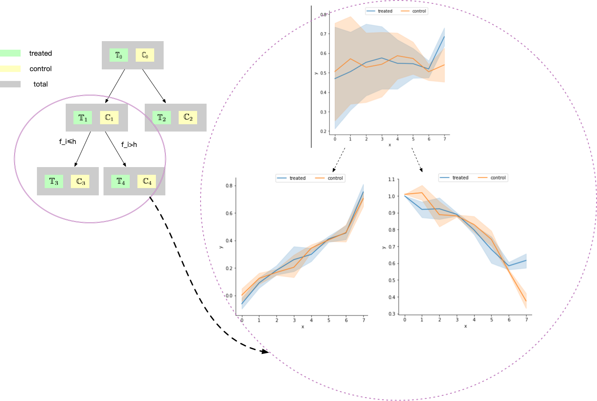

Debiased Causal Tree
====================

Introduction
------------

Causal tree or tree-based methods [1,2,3,4] are methods for estimating (heterogeneous) treatment effects (HTE). Causal trees are a powerful tool in causal inference and machine learning for estimating (heterogeneous) treatment effects. Although under some assumptions they can estiamte the HTE on the observational data, they also suffer from potential confounding bias. The debiased causal trees offer debiasing techniques to address potential confounding bias and enhance the accuracy of treatment effect estimation. By incorporating historical outcomes and considering the confounding factors, these debiased causal trees aim to provide more reliable and unbiased estimates of treatment effects.

Our package offers several variants for both regression and classification tasks.

Usage
-----

*Example : training*

.. code-block:: python

    from openasce.inference.tree import GradientBoostingCausalRegressionTree
    # omitting the code of reading n samples
    ...
    # create a model to handle the case that we can observed `n_period` timesteps outcomes and treatment is imposed at `treat_dt`-th (count from zero).
    m = GradientBoostingCausalRegressionTree(n_period=8, treat_dt=7)
    # features: covariates (numpy array or pandas DataFrame) with shape [n, d]
    # targets: outcomes (numpy array or pandas DataFrame) with shape [n, n_period]
    # treatment: binary treatments (numpy array or pandas DataFrame) with shape [n]
    m.fit(features, targets, treatment)

*Example : predicting*

.. code-block:: python

    # Case 1: Given the test covarites `features_test`, predict treatment effect.
    tau_hat = m.effect(features_test)
    # Or
    tau_hat = m.predict(features_test, 'effect')
    # Case 2: Given the test covarites `features_test`, predict leaf index.
    leaf_ids = m.predict(features_test, 'leaf_id')

*Example : getting feature importance*

.. code-block:: python

    # Get the splitting counts of each feature
    feature_counts = m.split_counts(feature_names=['feature names'])

*Example : data without histrical outcomes, e.g. IHDP and In this case, GBCT would degrade to a vanilla causal tree.*

- Step 1 Download IHDP data

.. code-block:: shell

    wget --no-check-certificate http://www.fredjo.com/files/ihdp_npci_1-1000.train.npz.zip -O ihdp_npci_1-1000.train.npz
    unzip ihdp_npci_1-1000.train.npz.zip
    rm ihdp_npci_1-1000.train.npz.zip
    wget --no-check-certificate http://www.fredjo.com/files/ihdp_npci_1-1000.test.npz.zip -O ihdp_npci_1-1000.test.npz
    unzip ihdp_npci_1-1000.test.npz.zip
    rm ihdp_npci_1-1000.test.npz.zip

- Step 2 Train, predict and evaluate

.. code-block:: python

    import numpy as np
    from openasce.inference.tree import GradientBoostingCausalRegressionTree

    def get_data(data, idx):
        _X = data.f.x[:, :, idx]
        _D = data.f.t[:, idx]
        _Y = data.f.yf[:, idx]
        _CY = data.f.ycf[:, idx]
        _tau = data.f.mu1[:, idx]-data.f.mu0[:, idx]
        return np.asarray(_X, order='F'), np.asarray(_Y, order='F'), np.asarray(_D, np.int32, order='F'), np.asarray(_tau, order='F')

    tr_path = 'ihdp_npci_1-1000.train.npz'
    te_path = 'ihdp_npci_1-1000.test.npz'

    # Load data
    tr_data = np.load(tr_path)
    te_data = np.load(te_path)

    # Build model
    m = GradientBoostingCausalRegressionTree(n_period=1, treat_dt=0)
    ## Ttrain
    idx = 0 # Just for fold 0
    X, Y, D, tau = get_data(tr_data, idx)
    # Notice: Although without historical treatment, you should guarantee outcomes is 2-dimentional matrix.
    m.fit(X, np.expand_dims(Y, -1), D)
    ## Evaluate
    X_, Y_, D_, tau_ = get_data(te_data, idx)
    tau_hat = m.effect(X_)
    print(f'PEHE: {np.sqrt(np.square(np.squeeze(tau_hat) - tau_).mean()):.2f}')

Overview of Formal Methodology
------------------------------

Confounding Bias in Causal Tree
~~~~~~~~~~~~~~~~~~~~~~~~~~~~~~~

In general, causal trees output the effect by taking the difference in means between the treated group and the control group samples at the each leaf node. For example, :math:`\hat{\tau}=N_t^{-1}\sum_{i:d_i=1} y_i - N_c^{-1}\sum_{i:d_i=0} y_i`, where :math:`N_t` and :math:`N_c` represent the number of treated and control individuals respectively. And the estimator (mean difference) can be decomposed as follows:

.. math::

 \begin{align}
    \begin{aligned}
    \hat{\tau} &= \mathbb{E}[Y^{(1)}|D=1]-\mathbb{E}[Y^{(0)}|D=0]\\
    &= \mathbb{E}[Y^{(1)}-Y^{(0)}|D=1]+\mathbb{E}[Y^{(1)}-Y^{(0)}|D=0]+\mathbb{E}[Y^{(0)}|D=1]-\mathbb{E}[Y^{(1)}|D=0]\\
    &=\underbrace{\mathop{\mathbb{E}}_{q\in\{0,1\}}\mathbb{E}[Y^{(1)}-Y^{(0)}|W=q]}_{\tau~\text{average treatment effect}}+\underbrace{\mathbb{\mathbb{E}}[Y^{(0)}|D=1]-\mathbb{\mathbb{E}}[Y^{(0)}|D=0]}_{\mathcal{B}~~\text{the confounding bias}}+\\
    &~~~~p(D=0)\underbrace{(\mathbb{\mathbb{E}}[Y^{(1)}-Y^{(0)}|D=1]-\mathbb{\mathbb{E}}[Y^{(1)}-Y^{(0)}|D=0])}_{\text{heterogeneous treatment effect bias}}.
    \end{aligned}
 \end{align}

In the above formula, the first term represents the interest parameter (ground-truth treatment effect), which is usually unavailable. The second term represents the nuisance parameter ( **confounding bias** ). The last term represents the heterogeneous treatment effect bias. Typically, we are more interested in the treated group (Conditional Average Treatment Effect on The Treated group, **CATT**), and in this case the last term can be ignored (:math:`p(D=0)` equals to 0). While it is theoretically possible to eliminate confounding bias by satisfying some strong assumptions, it is often difficult to meet these assumptions in practice, and even if met, the optimal theoretical performance may not be achievable. Therefore, the following two debiased causal tree methods are designed to reduce confounding bias and improve the performance of effect estimation using historical outcomes.

Gradient Boost Debiased Causal Tree (GBCT)
~~~~~~~~~~~~~~~~~~~~~~~~~~~~~~~~~~~~~~~~~~

Let's start with the case of binary treatment, where :math:`D=d\in \{0,1\}` represents the treatment status. We denote :math:`Y^{(d)}_{t}\in\mathbb{R}` as the potential outcome at time :math:`t\in \{t_1,\ldots,t_m\}` for treatment :math:`D=d`. :math:`X\in {[0, 1]}^p` represents a time-invariant :math:`p`-dimensional covariate, and :math:`U` represents a possibly time-varying unmeasured confounder vector. The treatment is imposed at time :math:`t=t_m`, and the observed outcome is denoted as :math:`Y_{t_m}=D Y_{t_m}^{(1)}+ (1-D)Y_{t_m}^{(0)}`. Before the treatment occurs, the historical outcomes are denoted as :math:`Y_{t_k}=Y_{t_k}^{(0)}, 1\le k\le m-1`.

At the time step :math:`t=t_{t_m}`, we can reformulate the confounding bias as :math:`\mathcal{B}_{t_m} = \mathbb{\mathbb{E}}[Y^{(0)}_{t_m}|D=1]-\mathbb{\mathbb{E}}[Y^{(0)}_{t_m}|D=0]`. If we consider :math:`\mathcal{B}_{t_k}` as a function of time :math:`t_k`, it represents the confounding bias at time :math:`t={t_k}` where both :math:`\mathbb{\mathbb{E}}[Y^{(0)}{t_k}|D=0]` and :math:`\mathbb{\mathbb{E}}[Y^{(0)}{t_k}|D=1]` can be observed (e.g., :math:`\mathbb{\mathbb{E}}[Y_{t_m}]`) if the treatment has not been imposed, for example when :math:`k<m`. Compared to :math:`\mathcal{B}_{t_m}`, the :math:`\mathcal{B}_{t_k}` (when :math:`k<m`) is observable and available.

According to an assumption proposed by Tang.C[5], the confounding bias can be bounded by the historical confounding bias :math:`(m-1)^{-1}\sum_{k<m}\mathcal{B}_{t_k}`. Therefore, the **confounding entropy** is proposed to measure the discrepancy introduced by unobserved confounders between the conditional outcome distribution of the treated and control groups. The confounding entropy generalizes conventional confounding bias, which can be estimated effectively using historical outcomes. For example,

.. math::

    \begin{align}
        \widehat{H}_t(Q) \equiv - \sum_{i: X_i\in Q}\biggl\{\frac{D_i \log(\Pr(Y_{i,t};\widehat{\theta}_{t}^{(0)}))}{|\{i: X_i\in  {Q}, D_i=1\}|} +\frac{(1-D_i) \log(\Pr(Y_{i,t};\widehat{\theta}_{t}^{(1)}))}{|\{i: X_i\in  {Q}, D_i=0\}|}\biggr\},
    \end{align}

where :math:`\Pr\left(Y_{i,t};\widehat{\theta}_{t}^{(d)}\right)` denotes the conditional probability mass/density function of outcome on tree node Q at time :math:`t`.

The following figure depicts the process of a node splitting in a causal tree. In this example, we can observe 7 historical time points and 1 post-intervention time point. From the right sub-figure, we can find that the impact of confounding entropy loss leads the tree to split in the direction of minimizing the discrepancy of the conditional outcome distribution between the treated and control groups at pre-intervention periods.

    *Figure: GBCT debias*

Difference-in-Differences Causal Tree (DiDTree)
~~~~~~~~~~~~~~~~~~~~~~~~~~~~~~~~~~~~~~~~~~~~~~~

DiDTree[6] is a method that explicitly debiases estimation by subtracting the differences between the treatment and control groups over time. DiDTree relies on an assumption called **approximate conditional parallel trends** , which states that if the treated and control groups have followed a roughly parallel trend in the past, in the absence of treatment, they would continue to have a similar parallel trend in the near future.

**Approximate Conditional Parallel Trends Assumption**
For the function :math:`f^*(\cdot)=\arg\min_{f}(T-1)^{-1}\sum_{\tau=1}^{T-1} \mathbb{E}_{P}\big\{\big|f(X)-\mathcal{B}^*_{\tau}(X)\big|^2\big\},`
where :math:`P` denotes the marginal distribution of :math:`X`, it holds that

.. math::

    \begin{align}
        \frac{1}{T-1}\sum_{\tau=1}^{T-1} E_{P}\big\{\big|f^*(X)-\mathcal{B}^*_{\tau}(X)\big|^2\big\} &\equiv \varepsilon_{\text{history}}\geq E_{P}\big\{\big|f^*(X)-\mathcal{B}^*_{T}(X)\big|^2\big\}.
    \end{align}

Here, :math:`\varepsilon_{\text{history}}` measures the violation of parallel trends during the pre-intervention period and :math:`\mathcal{B}^*_t` denotes the conditional interval of control group and treated grounp, e.g. :math:`\mathbb{E}[Y_T^{(1)}-Y_T^{(0)}|X]`.

.. figure:: ../../../img/DiD.png

    Figure: DiD demo

In DiDTree, the confounding bias :math:`\mathcal{B}_{t_k}`, which represents the interval between the treated and control groups at time :math:`t_k`, is used to assess the parallelism between the groups. The assumption of approximate conditional parallel trends is equivalent to assuming that :math:`\mathcal{B}{t_i}\approx\mathcal{B}_{t_j}` for any two pre-intervention timesteps :math:`i,j<m`. To estimate the optimal pre-intervention interval, denoted as :math:`\mathcal{B}^*`, we minimize the squared difference between :math:`\mathcal{B}_{t_k}` and :math:`\delta` for the pre-intervention :math:`(T-1)` time points,

.. math::

    \begin{align}
        \delta^*(Q) = \arg\min_{\delta}R_{//}(\delta,Q) = \frac{1}{T-1}\sum_{\tau=1}^{T-1}\sum_{i\colon X_{i,\tau}\in Q}\big|\delta - (-1)^{D_i}\big\{ \widehat{\mu}^{(1-D_i)}_{\tau}(Q) - Y_{i,\tau}\big\} \big|^2,
    \end{align}

where Q represents set of instance (instances in tree node) and :math:`\hat{\mu}_{\tau}^{(d)}` denotes the empirical estimtion for :math:`\mathbb{E}{[Y^{(d)}_{\tau}|X\in Q]}`. And then :math:`\delta^*(Q)` is treated as an estimation for the confounding bias (:math:`\mathcal{B}_{t_m}`), which will be subtracted in the estimation process.

Other details of implementation
-------------------------------

- Both GBCT and DiDTree are ensembled by gradient boosting, and they use the L2-norm to penalize model (refer to parameter ``lambd``).
- In DiDTree, we also penalize the interval by l2-norm, e.g. :math:`\left(\sum_{k=1}^{K}\delta(Q_k)\right)^2` (refer to parameter ``parallel_l2``).

References
----------

1. Athey, S., & Imbens, G. (2016). Recursive partitioning for heterogeneous causal effects. Proceedings of the National Academy of Sciences, 113(27), 7353–7360. https://doi.org/10.1073/pnas.1510489113
2. Hahn, P. R., Murray, J. S., & Carvalho, C. (2019). Bayesian regression tree models for causal inference: Regularization, confounding, and heterogeneous effects. arXiv:1706.09523 [Stat]. http://arxiv.org/abs/1706.09523
3. Rzepakowski, P., & Jaroszewicz, S. (2012). Decision trees for uplift modeling with single and multiple treatments. Knowledge and Information Systems, 32, 303-327.
4. Athey, S., Tibshirani, J., & Wager, S. (2018). Generalized Random Forests. arXiv:1610.01271 [Econ, Stat]. http://arxiv.org/abs/1610.01271
5. Tang, C., Wang, H., Li, X., Cui, Q., Zhang, Y.-L., Zhu, F., Li, L., & Zhou, J. (2022). Debiased Causal Tree: Heterogeneous Treatment Effects Estimation with Unmeasured Confounding. Advances in Neural Information Processing Systems 36, 16.
6. Tang, C., Wang, H., Li, X., Qing, C., Li, L., & Zhou, J. (2023). Difference-in-Differences Meets Tree-Based Methods: Heterogeneous Treatment Effects Estimation with Unmeasured Confounding. Proceedings of the 40th International Conference on Machine Learning.
7. Ke, G., Meng, Q., Finley, T., Wang, T., Chen, W., Ma, W., ... & Liu, T. Y. (2017). Lightgbm: A highly efficient gradient boosting decision tree. Advances in neural information processing systems, 30.